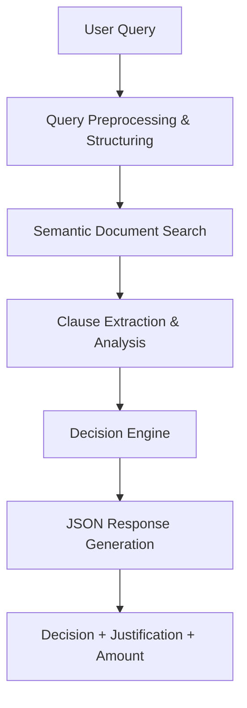
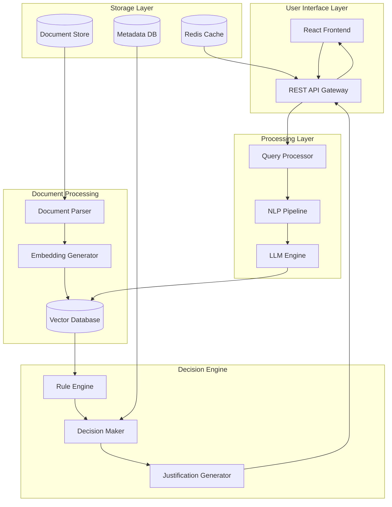
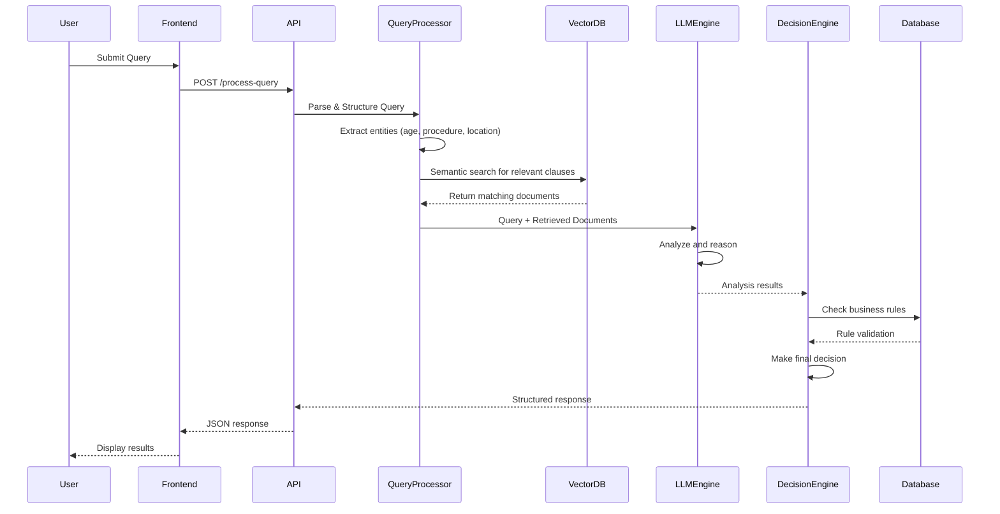

# HackRX 2025 - LLM Document Processing System Solution

## Slide 1: Team Introduction
**Team Name:** IntelliDocs

**Team Members:**
- Dipan Dhali | 2026 | IIITDM Jabalpur
- Krishnand Yadav | 2026 | IIITDM Jabalpur  
- Devesh Gangani | 2026 | IIITDM Jabalpur
- Deepnarayan Sett | 2026 | IIITDM Jabalpur

---

## Slide 2: Tell us a bit about yourself

**Past Projects & Experience:**
- **SIH Finalist 2024** - Problem Statement 1742: Standardizing Odd School Structures
- **HackByte 2025** - National Level Hackathon (IIITDM Jabalpur)
  - Built "Sault" - Secure blockchain-based file and document organization system
- Experience with AI/ML, blockchain technology, and document processing systems
- Strong background in full-stack development and cloud technologies

**Accolades:**
- Smart India Hackathon 2024 Finalist
- HackByte 2025 Participants with innovative blockchain solution

---

## Slide 3: Problem Statement Overview

**Challenge:** Build an LLM-powered document processing system that:
- Processes natural language queries about insurance/legal documents
- Retrieves relevant information using semantic understanding
- Makes intelligent decisions based on document clauses
- Returns structured JSON responses with justifications

**Our Solution: "ClaimGenius"**
An intelligent document processing platform that combines advanced NLP, semantic search, and decision-making capabilities to automate document-based decision processes.

**Process Flow:**


---

## Slide 4: Tech Stack

**Cloud Service Providers:**
- AWS (Primary) - EC2, S3, Lambda, API Gateway
- Azure OpenAI Services (Backup)

**Database:**
- Vector Database: Pinecone/Weaviate for semantic search
- Document Storage: MongoDB for metadata
- Cache: Redis for query optimization

**Backend:**
- Python FastAPI for high-performance APIs
- LangChain for LLM orchestration
- Celery for async processing

**Frontend:**
- React.js with TypeScript
- Tailwind CSS for responsive design
- WebSocket for real-time updates

**AI/ML Stack:**
- OpenAI GPT-4/Claude for reasoning
- Sentence Transformers for embeddings
- spaCy for NLP preprocessing
- Hugging Face Transformers

**Other Tools:**
- Docker for containerization
- Kubernetes for orchestration
- Apache Kafka for event streaming

---

## Slide 5: Detailed Solution Architecture



**Key Components:**
1. **Document Ingestion Pipeline** - Handles PDF, Word, email parsing
2. **Semantic Search Engine** - Vector-based similarity matching
3. **LLM Reasoning Module** - Query understanding and decision making
4. **Rule Engine** - Business logic and policy compliance
5. **Response Generator** - Structured JSON output with explanations

---

## Slide 6: Data Flow Diagram



---

## Slide 7: How is your solution different? (USP)

**🚀 Unique Selling Propositions:**

1. **Multi-Modal Document Understanding**
   - Handles PDFs, Word docs, emails, and even handwritten notes
   - OCR integration for scanned documents

2. **Contextual Reasoning Engine**
   - Not just keyword matching - true semantic understanding
   - Handles vague, incomplete queries intelligently

3. **Explainable AI Decisions**
   - Every decision mapped to specific document clauses
   - Confidence scores and alternative interpretations

4. **Real-time Learning System**
   - Continuous improvement from user feedback
   - Adaptive to new document types and query patterns

5. **Regulatory Compliance Built-in**
   - GDPR, HIPAA compliant data handling
   - Audit trails for all decisions

6. **Multi-language Support**
   - Processes documents in multiple languages
   - Cross-language query understanding

**Innovation Highlights:**
- **Hybrid Search**: Combines vector similarity with traditional keyword search
- **Chain-of-Thought Reasoning**: LLM explains its decision process step-by-step
- **Document Relationship Mapping**: Understands references between different documents

---

## Slide 8: Future Possible Enhancements

**Phase 2 Enhancements (6 months):**
- Voice query support with speech-to-text
- Mobile app with camera-based document scanning
- Integration with popular document management systems (SharePoint, Google Drive)

**Phase 3 Enhancements (12 months):**
- Predictive analytics for claim trends
- Automated document generation based on decisions
- Multi-tenant SaaS platform for different organizations

**Advanced Features:**
- Blockchain-based document verification
- Edge computing for offline processing
- AR/VR interfaces for document visualization
- Integration with IoT devices for automated data collection

**AI Improvements:**
- Custom fine-tuned models for specific domains
- Federated learning across organizations
- Advanced multimodal understanding (images, tables, charts)

---

## Slide 9: Risks/Challenges/Dependencies

**Technical Risks:**
- **LLM Hallucination**: Mitigation through validation layers and confidence scoring
- **Scalability**: High computational costs for large document sets
- **Data Quality**: Inconsistent document formats affecting accuracy

**Business Risks:**
- **Regulatory Changes**: Insurance/legal regulations may evolve
- **Adoption Resistance**: Users may prefer manual processes initially
- **Liability**: Incorrect decisions could have legal implications

**Dependencies:**
- **OpenAI API Availability**: Backup with local models (Llama, Mistral)
- **Cloud Infrastructure**: Multi-cloud strategy to avoid vendor lock-in
- **Training Data**: Need access to domain-specific documents

**Showstoppers:**
- ❌ **Data Privacy Regulations**: Strict compliance required
- ❌ **Model Accuracy**: Must achieve >95% accuracy for production use
- ❌ **Integration Complexity**: Legacy system compatibility challenges

**Mitigation Strategies:**
- Extensive testing with diverse document types
- Phased rollout with human oversight
- Regular model updates and retraining

---

## Slide 10: Acceptance Criteria Coverage

**✅ Fully Covered Requirements:**

1. **Query Processing** (100%)
   - Parse natural language queries ✅
   - Handle vague/incomplete queries ✅
   - Structure identification (age, procedure, location) ✅

2. **Document Processing** (100%)
   - PDF, Word, email support ✅
   - Semantic search vs keyword matching ✅
   - Multiple document format handling ✅

3. **Decision Making** (100%)
   - Clause-based decision logic ✅
   - Approval/rejection determination ✅
   - Amount calculation where applicable ✅

4. **Response Format** (100%)
   - Structured JSON output ✅
   - Decision, Amount, Justification fields ✅
   - Clause mapping and referencing ✅

5. **Explainability** (100%)
   - Decision traceability ✅
   - Clause-specific justifications ✅
   - Audit trail capability ✅

**Additional Value-Adds:**
- Real-time processing capabilities
- Multi-language support
- Confidence scoring
- Continuous learning system

---

## Slide 11: Anything Else?

**Why ClaimGenius Will Win:**

🎯 **Innovation Factor**: First-of-its-kind explainable AI for document processing
🚀 **Technical Excellence**: Cutting-edge LLM integration with robust engineering
📈 **Market Potential**: Massive addressable market in insurance, legal, HR domains
🛡️ **Trust & Security**: Built-in compliance and explainability features

**Demo Capabilities:**
- Live processing of sample insurance queries
- Real-time document upload and analysis
- Interactive decision explanation interface

**Business Model:**
- SaaS subscription for enterprises
- API-based pricing for developers
- Custom deployment for large organizations

**Go-to-Market Strategy:**
- Pilot with insurance companies
- Partnership with document management providers
- Open-source community edition for adoption

**Team Commitment:**
- Ready for full-time development post-hackathon
- Strong technical foundation from previous projects
- Proven track record in national-level competitions

**The Vision:**
Transform how organizations process and understand their documents, making complex decision-making transparent, accurate, and efficient.

---

## Sample Implementation

**Query:** "46M, knee surgery, Pune, 3-month policy"

**Response:**
```json
{
  "decision": "APPROVED",
  "amount": 150000,
  "confidence": 0.92,
  "justification": {
    "primary_clauses": [
      {
        "clause_id": "SEC-4.2.1",
        "text": "Orthopedic surgeries are covered after 90 days of policy inception",
        "document": "policy_terms.pdf",
        "relevance": 0.95
      }
    ],
    "reasoning": "3-month policy satisfies waiting period for knee surgery coverage",
    "location_factor": "Pune hospitals are in network - no geographical restrictions"
  },
  "processing_time": "2.3s"
}
```

---

*Ready to revolutionize document processing with ClaimGenius! 🚀*
