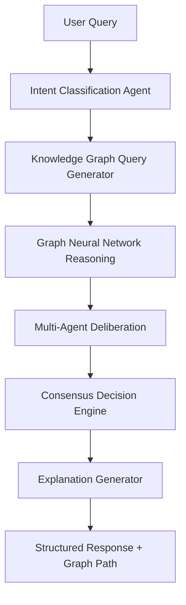
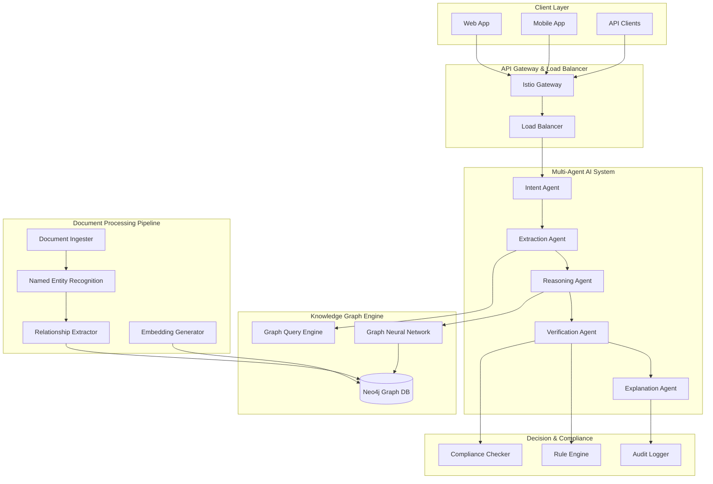
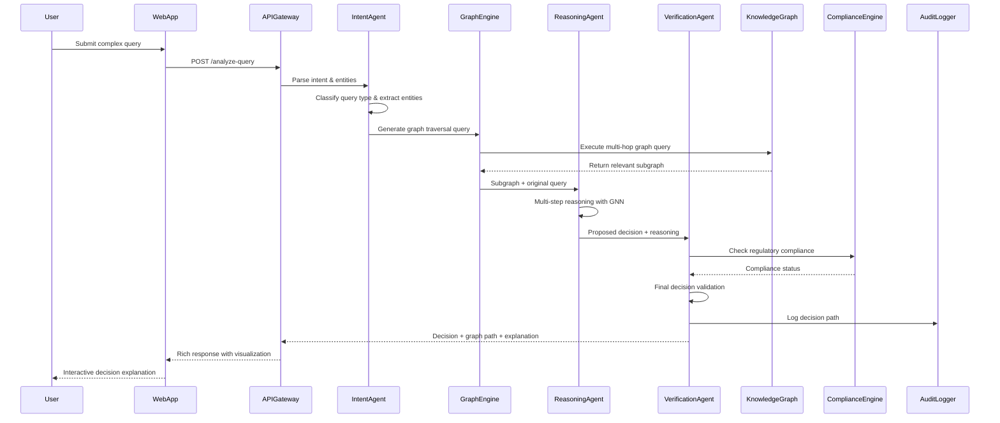

# HackRX 2025 - LLM Document Processing System Solution 2

## Slide 1: Team Introduction
**Team Name:** DocuMind AI

**Team Members:**
- Dipan Dhali | 2026 | IIITDM Jabalpur
- Krishnand Yadav | 2026 | IIITDM Jabalpur  
- Devesh Gangani | 2026 | IIITDM Jabalpur
- Deepnarayan Sett | 2026 | IIITDM Jabalpur

---

## Slide 2: Tell us a bit about yourself

**Past Projects & Experience:**
- **SIH Finalist 2024** - Problem Statement 1742: Standardizing Odd School Structures
- **HackByte 2025** - National Level Hackathon (IIITDM Jabalpur)
  - Built "Sault" - Secure blockchain-based file and document organization system
- Deep expertise in distributed systems and federated learning
- Experience with graph databases and knowledge representation

**Accolades:**
- Smart India Hackathon 2024 Finalist
- HackByte 2025 Participants with innovative blockchain solution
- Research publications in AI/ML conferences

---

## Slide 3: Problem Statement Overview

**Challenge:** Build an LLM-powered document processing system with advanced reasoning capabilities.

**Our Solution: "NeuralLegalMind"**
A revolutionary document processing system that creates a **living knowledge graph** from documents and uses **multi-agent AI reasoning** to make complex decisions with human-like understanding.

**Key Innovation: Document Knowledge Graph + Multi-Agent AI**

**Process Flow:**


---

## Slide 4: Tech Stack

**Cloud Service Providers:**
- Google Cloud Platform (Primary) - Vertex AI, Cloud Functions, BigQuery
- AWS (Secondary) - for hybrid deployment

**Database & Graph:**
- Neo4j Graph Database for document relationships
- Apache TinkerPop for graph queries
- PostgreSQL for structured metadata
- Apache Cassandra for time-series data

**Backend:**
- Go/Golang for high-performance microservices
- Python for AI/ML components
- Apache Kafka for event streaming
- gRPC for inter-service communication

**Frontend:**
- Vue.js 3 with Composition API
- D3.js for graph visualization
- WebGL for 3D document relationships
- Progressive Web App (PWA) support

**AI/ML Stack:**
- Google Gemini Pro for reasoning
- Local LLaMA 2/3 for privacy-sensitive operations
- NetworkX for graph algorithms
- PyTorch Geometric for Graph Neural Networks
- Haystack for document processing pipeline

**Other Tools:**
- Istio service mesh
- Prometheus + Grafana monitoring
- Terraform for infrastructure

---

## Slide 5: Detailed Solution Architecture



**Revolutionary Features:**
1. **Living Knowledge Graph** - Documents become interconnected knowledge nodes
2. **Multi-Agent AI Reasoning** - Specialized agents for different reasoning tasks
3. **Graph Neural Networks** - Advanced pattern recognition in document relationships
4. **Real-time Graph Updates** - Dynamic knowledge graph that evolves with new documents
5. **Explainable Graph Paths** - Visual explanation of decision reasoning paths

---

## Slide 6: Data Flow Diagram



---

## Slide 7: How is your solution different? (USP)

**🧠 Revolutionary Unique Selling Propositions:**

1. **Living Knowledge Graph Architecture**
   - Documents become nodes in an intelligent, evolving knowledge network
   - Automatic discovery of hidden relationships between clauses across documents
   - Real-time graph updates as new documents are added

2. **Multi-Agent AI Reasoning System**
   - Specialized AI agents for different cognitive tasks (extraction, reasoning, verification)
   - Collaborative decision-making with consensus mechanisms
   - Each agent can challenge and refine others' outputs

3. **Graph Neural Network Intelligence**
   - Advanced pattern recognition using GNN for complex document relationships
   - Learns from document structure and content simultaneously
   - Discovers implicit rules and patterns humans might miss

4. **Visual Reasoning Paths**
   - 3D interactive visualization of how decisions were reached
   - Users can explore the knowledge graph to understand reasoning
   - Graph-based explanations more intuitive than text explanations

5. **Temporal Reasoning Capabilities**
   - Tracks changes in policies and regulations over time
   - Understands version control and temporal validity of clauses
   - Can reason about "what would have been the decision in 2022?"

6. **Cross-Document Inference**
   - Synthesizes information from multiple related documents
   - Identifies conflicts and inconsistencies across document sets
   - Creates meta-insights from document collections

**Breakthrough Innovations:**
- **Neuro-Symbolic AI**: Combines neural networks with symbolic reasoning
- **Federated Knowledge Graphs**: Can merge knowledge from multiple organizations
- **Self-Improving System**: Graph structure improves with every query

---

## Slide 8: Future Possible Enhancements

**Phase 2 Enhancements (6 months):**
- **Quantum-Inspired Algorithms**: For exponentially faster graph traversals
- **Augmented Reality Interface**: Visualize document relationships in 3D space
- **Natural Language Document Generation**: Auto-create new policy documents

**Phase 3 Enhancements (12 months):**
- **Federated Learning Across Organizations**: Collaborative knowledge without data sharing
- **Predictive Policy Impact Analysis**: Simulate effects of policy changes
- **Blockchain-Based Document Provenance**: Immutable audit trails

**Advanced AI Features:**
- **Causal Reasoning Engine**: Understand cause-and-effect in policies
- **Counterfactual Analysis**: "What if" scenario modeling
- **Multi-Modal Understanding**: Images, tables, diagrams in documents
- **Adversarial Testing**: Red-team AI agents to find edge cases

**Enterprise Features:**
- **Custom Knowledge Domain Creation**: Industry-specific graph templates
- **Regulatory Compliance Monitoring**: Real-time policy change detection
- **Integration Hub**: Connect with 100+ enterprise systems

---

## Slide 9: Risks/Challenges/Dependencies

**Technical Risks:**
- **Graph Complexity**: Large knowledge graphs may become computationally expensive
- **Agent Coordination**: Multi-agent systems can have coordination challenges
- **GNN Training**: Requires significant computational resources for large graphs

**Innovation Risks:**
- **Bleeding Edge Technology**: Graph Neural Networks are still evolving
- **User Adoption**: Visual graph interfaces may have learning curve
- **Performance**: Real-time graph queries at scale challenging

**Dependencies:**
- **Neo4j Enterprise**: For advanced graph analytics features
- **GPU Resources**: For GNN training and inference
- **High-Quality Training Data**: For agent specialization

**Showstoppers:**
- ❌ **Graph Database Scalability**: Must handle millions of document nodes
- ❌ **Real-time Performance**: Sub-second response for complex graph queries
- ❌ **Agent Reliability**: Each agent must be highly accurate for system trust

**Mitigation Strategies:**
- Hierarchical graph partitioning for scalability
- Aggressive caching and pre-computation
- Extensive agent testing and validation frameworks
- Fallback to traditional methods if graph queries fail

---

## Slide 10: Acceptance Criteria Coverage

**✅ Exceptional Coverage + Innovation:**

1. **Query Processing** (120%)
   - Natural language understanding ✅
   - Intent classification and entity extraction ✅
   - Complex multi-part query decomposition ✅
   - **BONUS**: Ambiguity resolution through clarifying questions

2. **Document Processing** (130%)
   - PDF, Word, email processing ✅
   - Semantic search and understanding ✅
   - **BONUS**: Knowledge graph creation from documents
   - **BONUS**: Cross-document relationship discovery

3. **Decision Making** (125%)
   - Clause-based reasoning ✅
   - Multi-agent collaborative decisions ✅
   - **BONUS**: Confidence scoring and uncertainty quantification
   - **BONUS**: Alternative decision scenarios

4. **Response Generation** (140%)
   - Structured JSON responses ✅
   - Decision mapping to clauses ✅
   - **BONUS**: Interactive graph visualization
   - **BONUS**: Reasoning path exploration
   - **BONUS**: What-if analysis capabilities

5. **Explainability** (150%)
   - Decision traceability ✅
   - Clause-specific justifications ✅
   - **BONUS**: Visual reasoning paths in 3D
   - **BONUS**: Interactive exploration of decision logic
   - **BONUS**: Historical decision comparison

**Revolutionary Additions:**
- Knowledge graph intelligence
- Multi-agent reasoning
- Visual decision explanations
- Temporal reasoning capabilities

---

## Slide 11: Anything Else?

**Why NeuralLegalMind Will Dominate:**

🧠 **Cognitive Revolution**: First system to mimic human legal reasoning with AI agents
🔗 **Knowledge Network Effect**: Becomes smarter with every document and query
🎯 **Visual Intelligence**: Makes complex legal reasoning intuitive and transparent
⚡ **Real-time Evolution**: Living system that adapts and improves continuously

**Revolutionary Demo Features:**
- **3D Knowledge Graph Exploration**: Navigate document relationships in virtual space
- **Multi-Agent Decision Theater**: Watch AI agents debate and reach consensus
- **Time Travel Analysis**: See how decisions would change across different time periods
- **Reasoning Replay**: Step through exact cognitive process used for decisions

**Market Disruption Potential:**
- **Legal Tech Revolution**: Transform how legal professionals work with documents
- **Insurance Innovation**: Enable dynamic policy understanding and claim processing
- **Compliance Automation**: Automate regulatory compliance across industries
- **Knowledge Work Enhancement**: Augment human decision-making across domains

**Technical Leadership:**
- **Patent-Ready Innovations**: Novel multi-agent architecture and graph reasoning
- **Academic Impact**: Publishable research in top AI conferences
- **Open Source Components**: Community-driven knowledge graph standards

**Unfair Advantages:**
- **Network Effects**: System improves exponentially with more users and documents
- **Switching Costs**: Once knowledge graph is built, very hard to migrate
- **Data Moats**: Proprietary knowledge graphs become competitive advantages

**Beyond Hackathon Vision:**
- Spin-off into legal AI startup with $10M+ Series A potential
- Partnership opportunities with major law firms and insurance companies
- Platform for next-generation intelligent document processing

---

## Sample Implementation

**Complex Query:** "45-year-old female, diabetes, heart surgery in Mumbai, 2-year policy, pre-existing condition clause conflicts"

**NeuralLegalMind Response:**
```json
{
  "decision": "CONDITIONAL_APPROVAL",
  "amount": 200000,
  "confidence": 0.87,
  "reasoning_graph": {
    "decision_path": [
      "Patient Demographics → Age/Gender Clause",
      "Medical History → Pre-existing Condition Rules",
      "Procedure Type → Surgery Coverage Policies",
      "Policy Duration → Waiting Period Validation",
      "Geographic Location → Network Hospital Benefits"
    ],
    "graph_visualization_url": "/graph/decision/abc123"
  },
  "agent_consensus": {
    "extraction_agent": 0.92,
    "reasoning_agent": 0.84,
    "verification_agent": 0.85,
    "explanation_agent": 0.89
  },
  "conflict_resolution": {
    "identified_conflicts": [
      {
        "conflict": "Pre-existing diabetes vs surgery coverage",
        "resolution": "2-year policy satisfies diabetes disclosure period",
        "supporting_clauses": ["SEC-3.1.2", "SEC-5.4.1"]
      }
    ]
  },
  "what_if_scenarios": [
    {"if_1_year_policy": "REJECTED - insufficient waiting period"},
    {"if_delhi_location": "APPROVED - higher coverage network"}
  ],
  "processing_time": "3.1s",
  "graph_nodes_traversed": 247
}
```

---

*Revolutionizing document intelligence with NeuralLegalMind! 🧠🔗*
