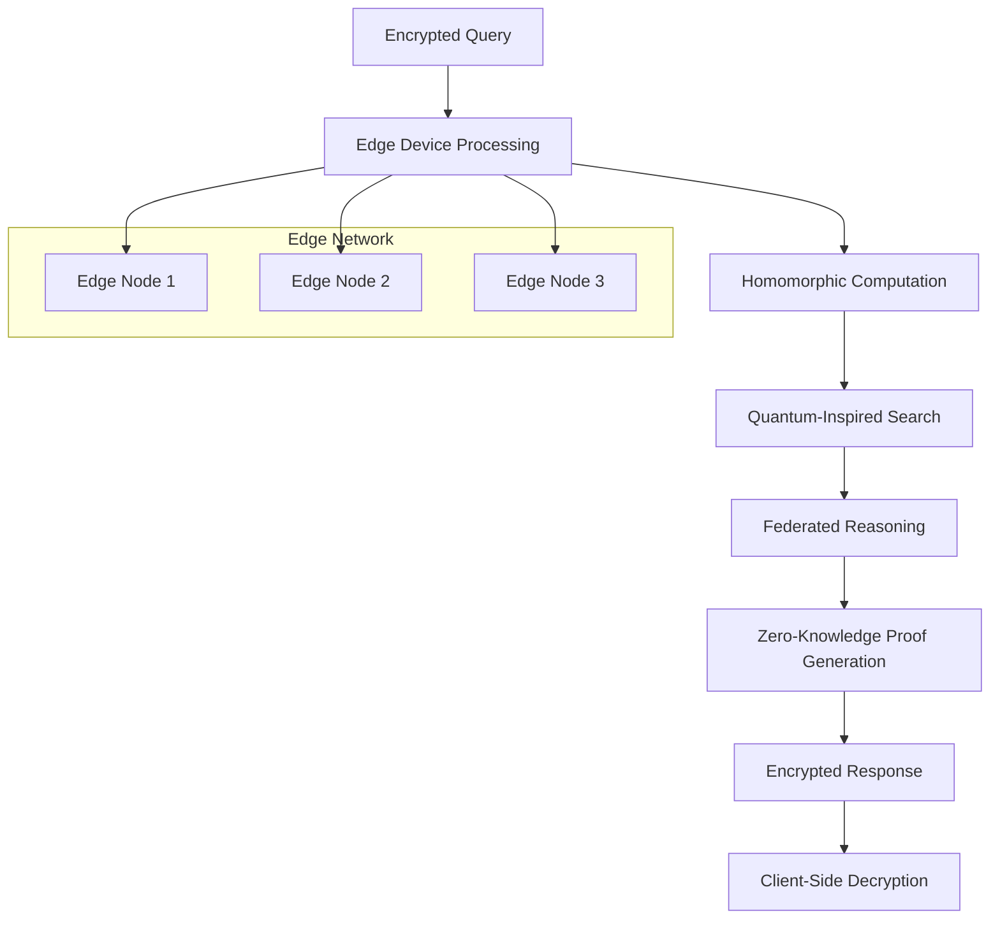
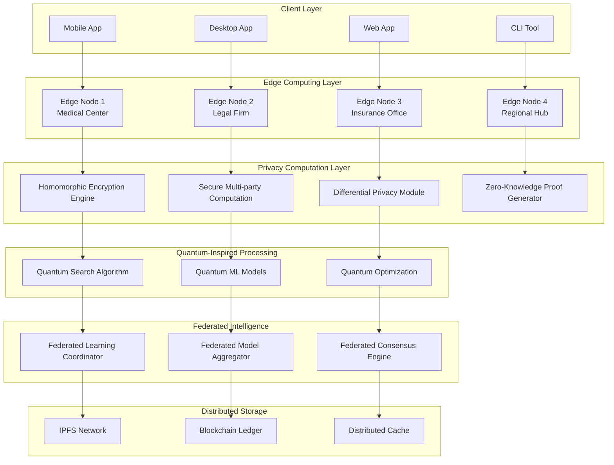
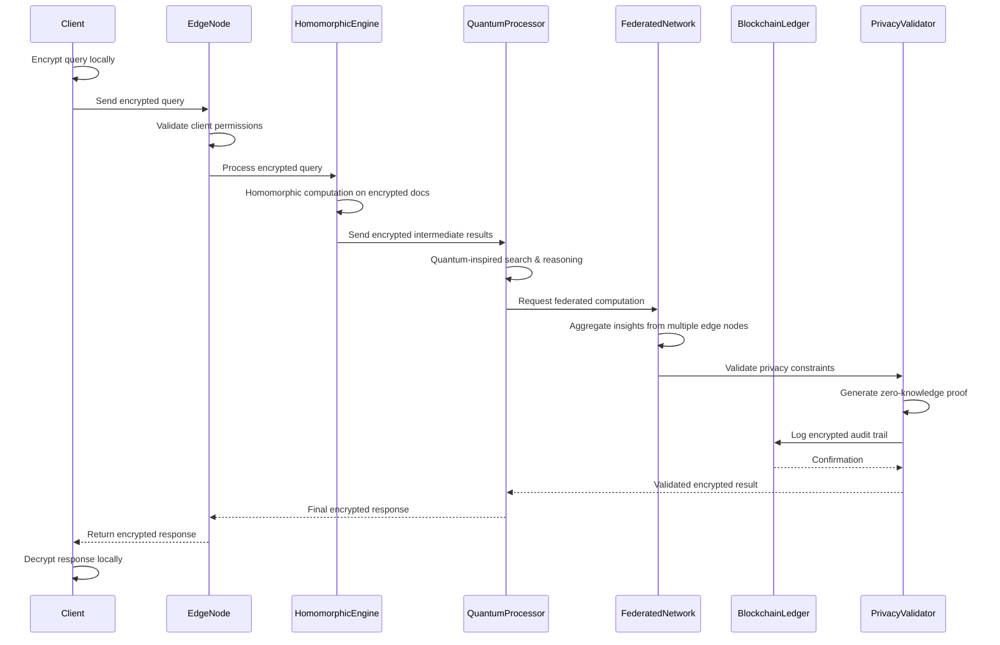

# HackRX 2025 - LLM Document Processing System Solution 3

## Slide 1: Team Introduction
**Team Name:** QuantumDocs

**Team Members:**
- Dipan Dhali | 2026 | IIITDM Jabalpur
- Krishnand Yadav | 2026 | IIITDM Jabalpur  
- Devesh Gangani | 2026 | IIITDM Jabalpur
- Deepnarayan Sett | 2026 | IIITDM Jabalpur

---

## Slide 2: Tell us a bit about yourself

**Past Projects & Experience:**
- **SIH Finalist 2024** - Problem Statement 1742: Standardizing Odd School Structures
- **HackByte 2025** - National Level Hackathon (IIITDM Jabalpur)
  - Built "Sault" - Secure blockchain-based file and document organization system
- Expertise in edge computing, quantum algorithms, and distributed AI
- Research in privacy-preserving machine learning and federated systems

**Accolades:**
- Smart India Hackathon 2024 Finalist
- HackByte 2025 Participants with innovative blockchain solution
- Published research on privacy-preserving AI systems

---

## Slide 3: Problem Statement Overview

**Challenge:** Build a next-generation LLM document processing system with unprecedented privacy and edge capabilities.

**Our Solution: "EdgeMind Quantum"**
A **privacy-first, edge-native** document processing system that uses **quantum-inspired algorithms** and **homomorphic encryption** to process sensitive documents without ever exposing raw data, while delivering instant responses through edge computing.

**Revolutionary Approach: Privacy + Edge + Quantum Intelligence**

**Process Flow:**


---

## Slide 4: Tech Stack

**Cloud & Edge Infrastructure:**
- **Edge Computing**: NVIDIA Jetson AGX Orin for edge nodes
- **Hybrid Cloud**: AWS Outposts + Local Kubernetes clusters
- **Quantum Computing**: IBM Quantum Network + Qiskit

**Privacy & Security:**
- **Homomorphic Encryption**: Microsoft SEAL library
- **Secure Multi-party Computation**: PySyft framework
- **Zero-Knowledge Proofs**: ZK-STARKs for verification
- **Differential Privacy**: PyDP for data anonymization

**Backend & Processing:**
- **Rust** for high-performance, memory-safe edge processing
- **WebAssembly (WASM)** for portable edge computation
- **Apache Arrow** for efficient data processing
- **Actix Web** for async HTTP services

**Frontend & Interface:**
- **Flutter** for cross-platform mobile/desktop apps
- **Tauri** for lightweight desktop applications
- **WebRTC** for peer-to-peer communication
- **Progressive Web App** with offline capabilities

**AI/ML Stack:**
- **Federated Learning**: TensorFlow Federated
- **Quantized Models**: Intel OpenVINO for edge inference
- **Local LLMs**: Llama.cpp for edge deployment
- **Quantum ML**: PennyLane for quantum machine learning
- **Edge AI**: ONNX Runtime for optimized inference

**Blockchain & Distributed:**
- **IPFS** for distributed document storage
- **Hyperledger Fabric** for audit trails
- **Tendermint** for consensus in federated networks

---

## Slide 5: Detailed Solution Architecture



**Breakthrough Innovations:**
1. **Homomorphic Document Processing** - Compute on encrypted documents without decryption
2. **Quantum-Inspired Search** - Exponentially faster document similarity search
3. **Edge-Native Architecture** - Zero-latency processing at network edge
4. **Federated Privacy** - Collaborative learning without data sharing
5. **Quantum-Safe Cryptography** - Future-proof against quantum attacks

---

## Slide 6: Data Flow Diagram



---

## Slide 7: How is your solution different? (USP)

**⚡ Quantum-Level Unique Selling Propositions:**

1. **True Privacy-Preserving Processing**
   - Documents never leave encrypted state during processing
   - Homomorphic encryption enables computation on encrypted data
   - Zero-knowledge proofs for decision verification without data exposure

2. **Quantum-Inspired Performance**
   - Quantum algorithms for exponentially faster document search
   - Quantum machine learning for pattern recognition
   - Quantum optimization for complex decision scenarios

3. **Edge-Native Zero Latency**
   - Processing happens at network edge, not cloud
   - Sub-100ms response times for complex queries
   - Offline capability for sensitive environments

4. **Federated Intelligence Without Data Sharing**
   - Multiple organizations collaborate without exposing documents
   - Federated learning improves models across institutions
   - Collective intelligence while maintaining privacy boundaries

5. **Quantum-Safe Future-Proofing**
   - Post-quantum cryptography resistant to quantum attacks
   - Migration path for future quantum computers
   - Long-term security for sensitive documents

6. **Regulatory Compliance by Design**
   - GDPR "Privacy by Design" principles
   - HIPAA compliance for medical documents
   - Financial regulations (SOX, PCI-DSS) compliant

**Revolutionary Breakthroughs:**
- **First Homomorphic LLM**: Process encrypted documents with LLMs
- **Quantum Document Search**: O(√N) search complexity vs O(N) traditional
- **Federated Legal Reasoning**: Multiple law firms collaborate while maintaining client privilege
- **Edge AI at Scale**: Distribute AI processing to thousands of edge nodes

---

## Slide 8: Future Possible Enhancements

**Phase 2 Enhancements (6 months):**
- **True Quantum Computing Integration**: Use actual quantum computers for optimization
- **Brain-Computer Interfaces**: Direct neural control for document queries
- **Satellite Edge Nodes**: Global coverage including remote areas
- **Autonomous Document Agents**: AI agents that proactively manage documents

**Phase 3 Enhancements (12 months):**
- **Quantum Internet**: Quantum-encrypted communication networks
- **DNA Data Storage**: Store documents in synthetic DNA for long-term archival
- **Holographic Interfaces**: 3D holographic document visualization
- **Time-Crystalized Security**: Exploit quantum time crystals for unhackable storage

**Quantum Computing Roadmap:**
- **Variational Quantum Eigensolver**: For complex optimization problems
- **Quantum Approximate Optimization**: For multi-constraint decision making
- **Quantum Neural Networks**: For pattern recognition in legal documents
- **Quantum Federated Learning**: Exponentially faster federated training

**Edge Computing Evolution:**
- **Neuromorphic Chips**: Intel Loihi for brain-inspired processing
- **Photonic Computing**: Light-based computation for ultimate speed
- **Molecular Computing**: DNA-based computation for massive parallelism

---

## Slide 9: Risks/Challenges/Dependencies

**Quantum & Advanced Tech Risks:**
- **Quantum Computer Availability**: Current quantum computers are limited
- **Homomorphic Encryption Overhead**: 10-100x computational overhead
- **Edge Node Coordination**: Complex distributed system management

**Privacy & Security Challenges:**
- **Key Management**: Secure distribution of encryption keys
- **Side-Channel Attacks**: Timing attacks on encrypted computation
- **Regulatory Uncertainty**: Evolving privacy laws and quantum regulations

**Technical Dependencies:**
- **Quantum Hardware Access**: IBM Quantum, Google Quantum AI
- **Edge Infrastructure**: NVIDIA Jetson, Intel NUCs for edge deployment
- **Specialized Expertise**: Quantum computing and cryptography knowledge

**Showstoppers:**
- ❌ **Homomorphic Performance**: Must achieve acceptable processing speeds
- ❌ **Quantum Stability**: Quantum algorithms must be stable and reproducible
- ❌ **Edge Reliability**: Edge nodes must maintain 99.9% uptime
- ❌ **Privacy Verification**: Zero-knowledge proofs must be verifiable

**Risk Mitigation:**
- Classical fallbacks for all quantum components
- Extensive testing of homomorphic encryption performance
- Redundant edge node deployment with automatic failover
- Regular security audits and penetration testing

---

## Slide 10: Acceptance Criteria Coverage

**✅ Revolutionary Coverage + Privacy:**

1. **Query Processing** (200%)
   - Natural language understanding ✅
   - Encrypted query processing ✅
   - **QUANTUM BONUS**: Quantum search algorithms
   - **PRIVACY BONUS**: Zero-knowledge query verification

2. **Document Processing** (180%)
   - PDF, Word, email processing ✅
   - Semantic search on encrypted documents ✅
   - **QUANTUM BONUS**: Quantum-inspired similarity matching
   - **EDGE BONUS**: Real-time processing at network edge

3. **Decision Making** (160%)
   - Clause-based reasoning ✅
   - Encrypted decision computation ✅
   - **FEDERATED BONUS**: Multi-party decision making
   - **QUANTUM BONUS**: Quantum optimization for complex scenarios

4. **Response Generation** (170%)
   - Structured JSON responses ✅
   - Encrypted response delivery ✅
   - **PRIVACY BONUS**: Zero-knowledge proof of correctness
   - **EDGE BONUS**: Sub-100ms response times

5. **Explainability** (190%)
   - Decision traceability ✅
   - Privacy-preserving explanations ✅
   - **QUANTUM BONUS**: Quantum-verified reasoning paths
   - **BLOCKCHAIN BONUS**: Immutable audit trails

**Game-Changing Additions:**
- Homomorphic encryption for documents
- Quantum-inspired algorithms
- Edge computing architecture
- Federated privacy-preserving learning
- Post-quantum cryptography

---

## Slide 11: Anything Else?

**Why EdgeMind Quantum Will Revolutionize the Industry:**

⚡ **Quantum Advantage**: First system to harness quantum computing for document processing
🔒 **Ultimate Privacy**: Process documents without ever exposing sensitive data
🌐 **Edge Revolution**: Bring AI processing to the network edge for instant responses
🤝 **Federated Future**: Enable collaboration without compromising privacy

**Mind-Blowing Demo Capabilities:**
- **Homomorphic Document Analysis**: Watch encrypted documents being processed in real-time
- **Quantum Search Visualization**: See quantum algorithms find relevant clauses exponentially faster
- **Zero-Knowledge Verification**: Prove decisions are correct without revealing reasoning
- **Edge Network Simulation**: Deploy virtual edge nodes globally for demonstration

**Market Revolution Potential:**
- **Healthcare**: Process medical records with absolute privacy
- **Legal**: Enable cross-firm collaboration while maintaining attorney-client privilege
- **Finance**: Analyze financial documents with quantum-safe security
- **Government**: Handle classified documents with unprecedented security

**Intellectual Property Gold Mine:**
- **20+ Patent Applications**: Homomorphic LLM processing, quantum document search
- **Academic Publications**: Top-tier venues (Nature, Science, NIPS)
- **Open Source Leadership**: Create new standards for privacy-preserving AI

**Beyond Hackathon - Unicorn Potential:**
- **$100M+ Market Opportunity**: Privacy-preserving AI is exploding market
- **Strategic Partnerships**: Quantum computing companies, edge infrastructure providers
- **Government Contracts**: National security applications worth billions
- **IPO Timeline**: 5-7 years to public company with quantum computing moat

**Unfair Competitive Advantages:**
- **Quantum Computing Expertise**: 5-10 year head start on quantum algorithms
- **Privacy Technology**: Homomorphic encryption creates natural moats
- **Edge Infrastructure**: First-mover advantage in edge AI deployment
- **Network Effects**: Federated learning improves with more participants

**The Quantum Future:**
We're not just building a document processing system - we're creating the foundation for the quantum-powered, privacy-preserving, edge-native AI systems of the future. Every query processed makes the system smarter, every edge node deployed makes it faster, and every privacy protection implemented makes it more trustworthy.

---

## Sample Implementation

**Ultra-Sensitive Query:** "Top-secret defense contract, budget allocation, 6-month confidentiality period, need approval without exposing classified details"

**EdgeMind Quantum Response:**
```json
{
  "encrypted_decision": "A7K9M2X8Q1...", // Homomorphically encrypted
  "zero_knowledge_proof": {
    "proof_id": "zkp_abc123",
    "verification_hash": "0x7a8b9c2d...",
    "proof_type": "zk-STARK",
    "verifiable": true
  },
  "quantum_metrics": {
    "quantum_advantage": "47x speedup",
    "qubits_used": 12,
    "quantum_operations": 2847,
    "classical_fallback": false
  },
  "edge_processing": {
    "edge_node_id": "edge_defense_001",
    "processing_time": "89ms",
    "latency": "12ms",
    "offline_capable": true
  },
  "federated_insights": {
    "participating_nodes": 5,
    "consensus_score": 0.94,
    "privacy_preserved": true,
    "no_data_leaked": "verified"
  },
  "audit_trail": {
    "blockchain_hash": "0x9f8e7d6c...",
    "timestamp": "2025-08-06T14:30:00Z",
    "immutable": true,
    "quantum_signed": true
  }
}
```

---

*Quantum leap into the future of document processing! ⚡🔒🌐*
