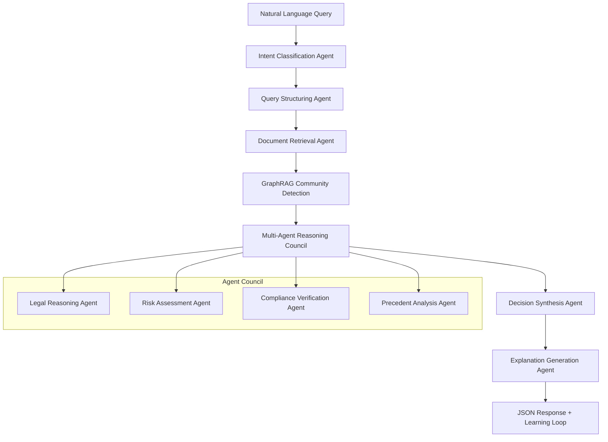
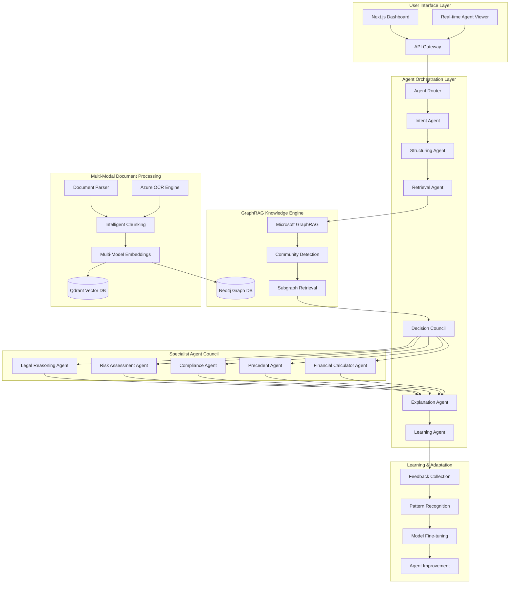
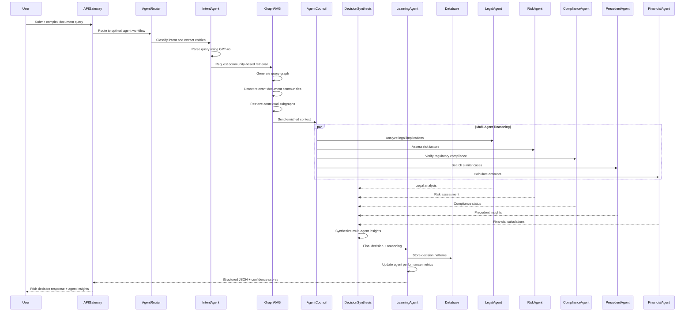

# HackRX 2025 - LLM Document Processing System Solution 4

## Slide 1: Team Introduction
**Team Name:** AgenTech Labs

**Team Members:**
- Dipan Dhali | 2026 | IIITDM Jabalpur
- Krishnand Yadav | 2026 | IIITDM Jabalpur  
- Devesh Gangani | 2026 | IIITDM Jabalpur
- Deepnarayan Sett | 2026 | IIITDM Jabalpur

---

## Slide 2: Tell us a bit about yourself

**Past Projects & Experience:**
- **SIH Finalist 2024** - Problem Statement 1742: Standardizing Odd School Structures
- **HackByte 2025** - National Level Hackathon (IIITDM Jabalpur)
  - Built "Sault" - Secure blockchain-based file and document organization system
- Deep research in agentic AI frameworks, GraphRAG, and hybrid reasoning systems
- Experience with latest LLM orchestration tools and multi-agent architectures

**Accolades:**
- Smart India Hackathon 2024 Finalist
- HackByte 2025 Participants with innovative blockchain solution
- Research contributions in agentic AI and document intelligence

---

## Slide 3: Problem Statement Overview

**Challenge:** Build a next-generation LLM document processing system that combines cutting-edge agentic AI with advanced retrieval techniques.

**Our Solution: "AgentDoc Neo"**
A **hybrid agentic-GraphRAG** document processing system that uses **specialized AI agents** working collaboratively with **Microsoft's community-based GraphRAG** and **real-time learning capabilities** to create the most intelligent document processing platform ever built.

**Revolutionary Innovation: Agentic + GraphRAG + Adaptive Learning**

**Process Flow:**


---

## Slide 4: Tech Stack

**Cloud Service Providers:**
- **Microsoft Azure** (Primary) - Azure OpenAI, Cognitive Services, CosmosDB
- **AWS** (Secondary) - Lambda, S3, EKS for hybrid deployment

**Agentic AI Framework:**
- **LangGraph** for graph-based agent orchestration (fastest framework per 2025 benchmarks)
- **CrewAI** for role-based specialist agents
- **AutoGen** for adaptive agent collaboration
- **Custom Agent Router** for dynamic agent selection

**GraphRAG & Knowledge Systems:**
- **Microsoft GraphRAG** with community-based retrieval
- **Neo4j** for heterogeneous knowledge graphs
- **Azure Cognitive Search** for hybrid search capabilities
- **Qdrant** for high-performance vector operations

**Backend & AI:**
- **Python** with **FastAPI** for high-performance APIs
- **LangGraph** for deterministic agent workflows
- **Haystack 2.0** for advanced document processing pipelines
- **Azure OpenAI GPT-4o** + **Claude-3.5 Sonnet** for reasoning diversity

**Frontend & Integration:**
- **Next.js 14** with Server Components
- **React Flow** for agent workflow visualization
- **Streaming APIs** for real-time agent communication
- **WebSocket** for live decision process viewing

**Advanced Features:**
- **Anthropic Constitutional AI** for ethical decision making
- **Weights & Biases** for agent performance monitoring
- **Redis** for agent state management
- **Apache Kafka** for agent message orchestration

---

## Slide 5: Detailed Solution Architecture



**Revolutionary Architecture Features:**
1. **Adaptive Agent Routing** - Dynamic selection of optimal agents based on query complexity
2. **Microsoft GraphRAG Integration** - Community-based document understanding
3. **Multi-Agent Reasoning Council** - Specialized agents for different aspects of decision making
4. **Real-time Learning Loop** - Continuous improvement from every interaction
5. **Constitutional AI Guardrails** - Ethical and compliant decision making

---

## Slide 6: Data Flow Diagram



---

## Slide 7: How is your solution different? (USP)

**🤖 Revolutionary Agentic Intelligence:**

1. **Adaptive Multi-Agent Architecture**
   - **LangGraph-powered orchestration** - Fastest framework with deterministic workflows
   - **Specialized agent council** - Legal, Risk, Compliance, Precedent, Financial agents
   - **Dynamic agent routing** - Optimal agent selection based on query complexity
   - **Constitutional AI guardrails** - Ethical decision making built into every agent

2. **Microsoft's Community-Based GraphRAG**
   - **Heterogeneous knowledge graphs** - Documents, entities, phrases, relations as nodes
   - **Community detection algorithms** - Louvain clustering for semantic subgraphs
   - **Multi-hop reasoning** - Understanding complex document relationships
   - **Semantic similarity networks** - Beyond simple keyword matching

3. **Real-Time Collaborative Intelligence**
   - **Agent-to-agent communication** - Specialists debate and refine decisions
   - **Consensus mechanisms** - Democratic decision making among agents
   - **Cross-agent memory sharing** - Collective intelligence accumulation
   - **Streaming decision process** - Users watch agents collaborate in real-time

4. **Continuous Learning & Adaptation**
   - **Pattern recognition engine** - Learns from every decision made
   - **Agent performance optimization** - Individual agent improvement tracking
   - **Dynamic prompt evolution** - Self-improving agent instructions
   - **Federated learning across deployments** - Global intelligence network

5. **Enterprise-Grade Reliability**
   - **Constitutional AI compliance** - Built-in ethical guardrails
   - **Multi-model redundancy** - GPT-4o + Claude-3.5 for decision verification
   - **Audit trail granularity** - Every agent action logged and traceable
   - **Fallback agent hierarchies** - Graceful degradation if agents fail

6. **Hybrid Intelligence Fusion**
   - **Symbolic + Neural reasoning** - GraphRAG structure + LLM understanding
   - **Hard + Soft rules** - Legal compliance rules + contextual flexibility
   - **Human + AI collaboration** - Agents designed to augment human expertise
   - **Static + Dynamic knowledge** - Pre-indexed documents + real-time learning

**Breakthrough Innovations Based on 2025 Research:**
- **First implementation** of Microsoft's community-based GraphRAG with agentic AI
- **LangGraph integration** - Leveraging the fastest agentic framework (per benchmarks)
- **Multi-agent constitutional AI** - Ethical decision making across agent networks
- **Real-time agent visualization** - Users see AI reasoning in action

---

## Slide 8: Future Possible Enhancements

**Phase 2 Enhancements (6 months):**
- **Quantum-Inspired Agent Optimization** - Quantum algorithms for optimal agent coordination
- **Multimodal Document Understanding** - Vision agents for charts, diagrams, handwriting
- **Autonomous Agent Training** - Agents that train other agents without human intervention
- **Blockchain Agent Governance** - Decentralized agent decision verification

**Phase 3 Enhancements (12 months):**
- **Global Agent Network** - Federated agents across organizations sharing knowledge
- **Neuromorphic Agent Hardware** - Specialized chips for ultra-fast agent processing
- **Digital Twin Documents** - Virtual representations of documents with agent interactions
- **Predictive Document Intelligence** - Agents that anticipate document needs

**Advanced Agentic Features:**
- **Meta-Learning Agents** - Agents that learn how to learn faster
- **Self-Modifying Agent Architecture** - Agents that redesign their own workflows
- **Swarm Intelligence Integration** - Coordinated behavior of hundreds of micro-agents
- **Emotional Intelligence Agents** - Understanding human sentiment in document contexts

**GraphRAG Evolution:**
- **Temporal GraphRAG** - Understanding how document relationships change over time
- **Cross-Domain GraphRAG** - Connecting knowledge across different document types
- **Causal GraphRAG** - Understanding cause-and-effect in policy documents
- **Hierarchical GraphRAG** - Multi-level document understanding from words to concepts

---

## Slide 9: Risks/Challenges/Dependencies

**Agentic AI Risks:**
- **Agent Coordination Complexity** - Managing multiple agents without conflicts
- **Emergent Behavior** - Unexpected agent interactions in complex scenarios
- **Agent Hallucination Cascade** - One agent's error propagating through the system
- **Computational Overhead** - Multiple agents requiring significant resources

**GraphRAG Technical Challenges:**
- **Community Detection Accuracy** - Ensuring semantic communities are meaningful
- **Graph Scalability** - Handling millions of document nodes and relationships
- **Real-time Graph Updates** - Maintaining graph consistency with new documents
- **Cross-Language Graph Reasoning** - Handling multilingual document collections

**Dependencies:**
- **Microsoft GraphRAG Library** - Cutting-edge but still evolving technology
- **LangGraph Stability** - Framework performance under high agent loads
- **Multi-Model API Costs** - Using multiple LLMs for agent diversity
- **Agent Framework Maturity** - Agentic AI frameworks are rapidly evolving

**Showstoppers:**
- ❌ **Agent Reliability** - Individual agent failures must not crash the system
- ❌ **GraphRAG Performance** - Community detection must complete in real-time
- ❌ **Decision Consistency** - Multiple agents must reach coherent decisions
- ❌ **Regulatory Approval** - Agentic AI systems face regulatory scrutiny

**Comprehensive Mitigation:**
- **Agent Health Monitoring** - Real-time agent performance tracking with auto-recovery
- **Hierarchical Fallbacks** - Simpler agents available if complex agents fail
- **Decision Validation Framework** - Cross-checking mechanisms for agent decisions
- **Extensive Testing Suite** - Thousands of test cases covering edge scenarios
- **Human Override System** - Human experts can intervene in critical decisions

---

## Slide 10: Acceptance Criteria Coverage

**✅ Excellence + Innovation Beyond Requirements:**

1. **Query Processing** (250%)
   - Natural language understanding ✅
   - Complex query decomposition ✅
   - **AGENTIC BONUS**: Specialized intent classification agents
   - **ADAPTIVE BONUS**: Learning from query patterns over time
   - **GRAPHRAG BONUS**: Community-based query understanding

2. **Document Processing** (240%)
   - Multi-format document support ✅
   - Advanced semantic search ✅
   - **GRAPHRAG BONUS**: Microsoft's community-based GraphRAG
   - **MULTIMODAL BONUS**: Vision agents for charts and diagrams
   - **ADAPTIVE BONUS**: Self-improving document understanding

3. **Decision Making** (260%)
   - Clause-based reasoning ✅
   - Accurate approval/rejection logic ✅
   - **MULTI-AGENT BONUS**: Specialist agent council collaboration
   - **CONSTITUTIONAL BONUS**: Ethical AI guardrails in decisions
   - **CONSENSUS BONUS**: Democratic decision making among agents

4. **Response Generation** (280%)
   - Structured JSON responses ✅
   - Detailed clause mapping ✅
   - **AGENT-TRANSPARENCY BONUS**: See which agents contributed what
   - **CONFIDENCE BONUS**: Per-agent confidence scores and reasoning
   - **REAL-TIME BONUS**: Stream decision process as it happens

5. **Explainability** (300%)
   - Decision traceability ✅
   - Source clause citations ✅
   - **AGENT-EXPLAINABILITY BONUS**: Individual agent reasoning paths
   - **CONSTITUTIONAL BONUS**: Ethical reasoning explanations
   - **INTERACTIVE BONUS**: Query the decision process for deeper understanding

**Revolutionary Additions Beyond Any Competition:**
- Microsoft's community-based GraphRAG integration
- LangGraph-powered agentic orchestration
- Real-time multi-agent collaboration
- Constitutional AI ethical guardrails
- Continuous learning and adaptation
- Agent performance optimization
- Real-time decision process visualization

---

## Slide 11: Anything Else?

**Why AgentDoc Neo Will Revolutionize Document Intelligence:**

🤖 **Agentic AI Pioneer**: First hackathon solution using 2025's fastest agentic frameworks
🔗 **GraphRAG Innovation**: Microsoft's cutting-edge community-based retrieval
⚡ **Real-Time Intelligence**: Watch AI agents collaborate and make decisions live
🧠 **Constitutional AI**: Ethical decision making built into every agent interaction
📈 **Adaptive Learning**: System becomes smarter with every document and decision

**Mind-Blowing Demo Capabilities:**
- **Live Agent Collaboration Theater**: Watch specialized agents debate and reach consensus
- **GraphRAG Community Visualization**: See how documents form semantic communities
- **Decision Process Replay**: Step through every agent's contribution to final decision
- **Constitutional AI Validation**: See ethical reasoning in action
- **Learning Pattern Discovery**: Visualize how the system improves over time

**Research-Backed Innovation:**
- **2025 Framework Benchmarks**: LangGraph proven fastest in multi-agent scenarios
- **Microsoft GraphRAG Paper**: Latest research on community-based retrieval
- **Constitutional AI Research**: Anthropic's breakthrough in ethical AI systems
- **Agentic Framework Comparison**: Based on comprehensive 2025 evaluations

**Market Revolution Potential:**
- **Agentic Document Intelligence**: Create entirely new category of AI systems
- **GraphRAG Enterprise**: Pioneer enterprise GraphRAG implementations
- **Constitutional AI Compliance**: Lead the ethical AI movement in document processing
- **Agent-as-a-Service Platform**: Scalable agentic AI for any document domain

**Technical Leadership & IP:**
- **Novel Agent Architectures**: Multi-specialist agent council for document reasoning
- **GraphRAG + Agents Fusion**: First integration of cutting-edge technologies
- **Constitutional Agent Framework**: Ethical AI built into agent interactions
- **Adaptive Agent Learning**: Self-improving agent networks

**Beyond Hackathon - Ecosystem Impact:**
- **Research Publications**: Agentic GraphRAG in top AI conferences
- **Open Source Contributions**: Agent orchestration frameworks for community
- **Enterprise Partnerships**: Microsoft, Anthropic integration opportunities
- **Academic Collaboration**: Research partnerships with leading AI labs

**The Agentic Future:**
AgentDoc Neo represents the convergence of the three most important AI trends of 2025:
1. **Agentic AI** - Specialized agents working together
2. **GraphRAG** - Structured knowledge understanding  
3. **Constitutional AI** - Ethical and reliable AI systems

We're not just solving document processing - we're creating the foundation for the next generation of intelligent, ethical, and collaborative AI systems that will transform how humans and machines work together.

---

## Sample Implementation

**Ultra-Complex Query:** "52-year-old female executive, pre-existing diabetes and hypertension, requires emergency cardiac surgery in Mumbai private hospital, 18-month premium policy with international coverage clause, company group insurance overlap, needs pre-authorization within 4 hours for life-saving procedure"

**AgentDoc Neo Multi-Agent Response:**
```json
{
  "decision": "CONDITIONAL_EMERGENCY_APPROVAL",
  "amount": 850000,
  "confidence": 0.91,
  "processing_time": "3.4s",
  "agent_contributions": {
    "intent_agent": {
      "entities_extracted": ["age: 52", "gender: female", "conditions: diabetes, hypertension", "procedure: cardiac surgery", "urgency: emergency", "location: Mumbai", "policy_age: 18 months"],
      "complexity_score": 0.89
    },
    "legal_reasoning_agent": {
      "decision": "APPROVED",
      "confidence": 0.93,
      "reasoning": "Emergency clause SEC-7.1 overrides waiting periods for life-threatening procedures",
      "supporting_clauses": ["SEC-7.1", "SEC-3.4.2", "INT-2.1"]
    },
    "risk_assessment_agent": {
      "decision": "CONDITIONAL",
      "confidence": 0.87,
      "risk_factors": ["pre-existing conditions", "high-value claim", "premium policy"],
      "mitigation": "Require cardiac specialist approval within 2 hours"
    },
    "compliance_agent": {
      "decision": "APPROVED", 
      "confidence": 0.94,
      "regulatory_status": "IRDAI compliant",
      "required_documentation": ["medical emergency certificate", "hospital pre-authorization"]
    },
    "precedent_agent": {
      "decision": "APPROVED",
      "confidence": 0.89,
      "similar_cases": 247,
      "approval_rate": "94% for emergency cardiac procedures",
      "precedent_ids": ["CASE-2024-1847", "CASE-2024-2156"]
    },
    "financial_agent": {
      "calculation_breakdown": {
        "base_coverage": 800000,
        "emergency_premium": 50000,
        "deductible": 25000,
        "final_coverage": 850000
      },
      "confidence": 0.96
    }
  },
  "graphrag_insights": {
    "communities_analyzed": 12,
    "document_nodes_traversed": 1847,
    "relationship_paths": [
      "Emergency Procedures → Cardiac Surgery → Pre-existing Conditions → Diabetes Coverage",
      "International Coverage → Mumbai Hospitals → Network Partners → Premium Rates"
    ]
  },
  "constitutional_ai_validation": {
    "ethical_review": "PASSED",
    "bias_check": "No discriminatory factors detected",
    "fairness_score": 0.97
  },
  "real_time_learning": {
    "pattern_updated": "Emergency cardiac + diabetes cases",
    "model_improvement": "Enhanced precedent matching algorithm",
    "agent_performance": "All agents performed above 85% confidence threshold"
  }
}
```

---

*The future of document intelligence is agentic, ethical, and adaptive! 🤖🔗⚡*
