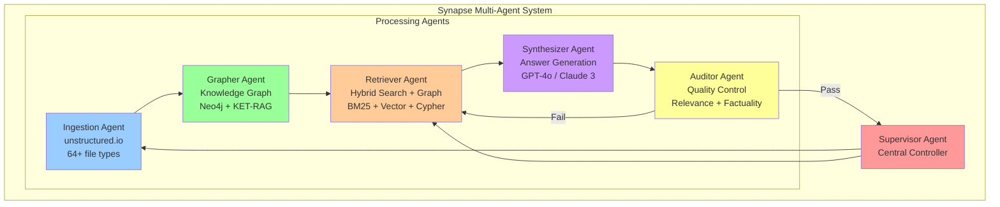
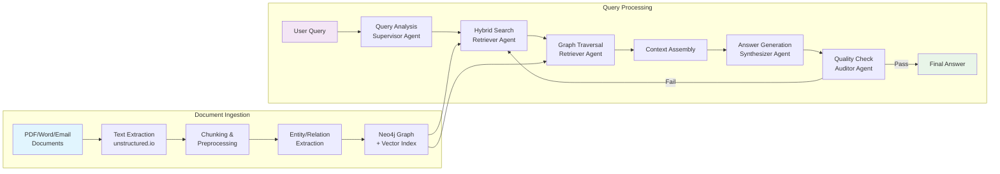
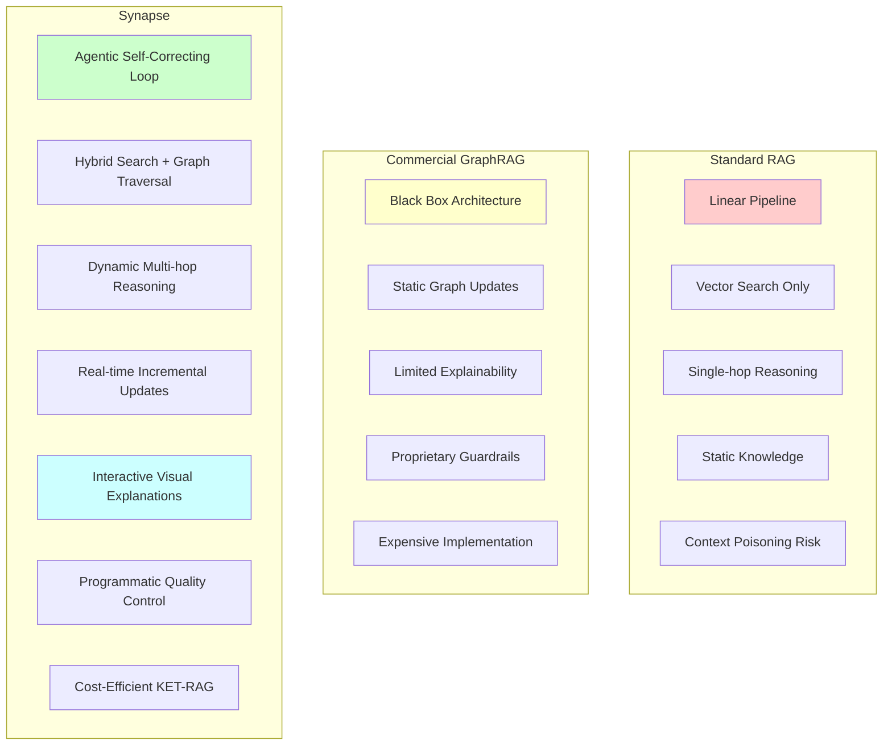
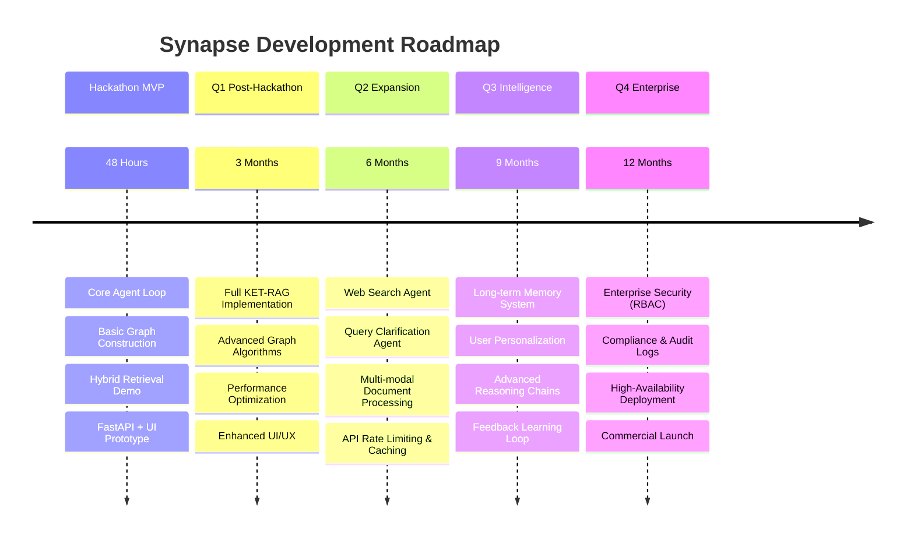

## Synapse: A Cognitive Agent Framework for Dynamic Document Intelligence

**Team**: Dipan Dhali, Krishnand Yadav, Devesh Gangani, Deepnarayan Sett
**Tagline**: "Beyond Retrieval. Towards Reasoning."

---

### The Problem: The Brittle Nature of Modern RAG

#### The Illusion of Understanding

Standard RAG systems fail at multi-hop reasoning due to context fragmentation. Vector similarity-based retrieval lacks logical or hierarchical awareness, resulting in systems that find facts but can't form knowledge.

#### The "Context Poisoning" Threat

Context poisoning occurs when irrelevant context misleads the LLM into generating plausible but inaccurate responses. The cause is rooted in flawed vector retrieval, which mixes relevant and unrelated data.

#### The Inefficiency of Static Knowledge

Static RAG systems are unsuitable for environments with dynamic documents. They degrade in accuracy over time due to their inability to reprocess new data efficiently.

#### The High Cost of Deep Reasoning

Knowledge graphs promise reasoning but are expensive to build and maintain. First-gen GraphRAG systems are too costly for dynamic document environments.

---

### Our Vision: A Living Knowledge Core

Synapse is a **cognitive agent framework** designed to:

* **Reason** across complex documents
* **Adapt** to new knowledge in real time
* **Explain** its conclusions clearly

#### Key Features

* **Deep Reasoning**: Multi-hop synthesis across documents
* **Programmed Resilience**: Self-correcting loop for factual accuracy
* **Radical Transparency**: Traceable, explainable reasoning

---

### The Synapse Architecture: A Multi-Agent Cognitive Loop

Implemented using **LangGraph**, Synapse replaces the brittle RAG pipeline with a modular agentic loop. Each agent performs a specific function.

#### Agents

* **Supervisor Agent**: Central controller, plans and delegates tasks
* **Ingestion Agent**: Uses unstructured.io to extract clean data from 64+ file types
* **Grapher Agent**: Builds and updates a knowledge graph using lightweight methods
* **Retriever Agent**: Employs Hybrid Search (BM25 + vector via RRF) and Graph Traversal
* **Synthesizer Agent**: Generates coherent answers using GPT-4o or Claude 3 Opus
* **Auditor Agent**: Performs Relevance, Factuality, and Completeness grading

---

### Deep Dive I: The Synapse Graph - Dynamic & Lightweight

#### Problem with "Heavy" GraphRAG

Heavy, static graphs are computationally intensive and not suited for dynamic corpora.

#### The Synapse Solution: KET-RAG Inspired Indexing

* **Identify Key Chunks**: High-value sections like summaries or intros
* **Build the Skeleton**: Detailed entity/relationship extraction only on key chunks
* **Lightweight Indexing for Rest**: Text-keyword bipartite graphs

#### Real-Time Incremental Updates

Uses Neo4j’s native graph update capabilities to evolve the graph dynamically as documents change.

---

### Deep Dive II: The Agentic Workflow - Programmed for Resilience

#### System Data Flow

#### Complex Query Example

> "Based on the project post-mortems, what was the primary cause of the 'Odyssey' project's budget overrun, and did the new procurement policy from Q3 have any effect?"

**Steps**:

1. **Retrieve**: Initial Hybrid Search fetches relevant documents
2. **Audit**: Documents relevant → move to generation
3. **Generate**: First answer is factual but incomplete
4. **Audit**: Completeness fails → loop triggers Graph Retrieval
5. **Retrieve Again**: Graph traversal finds indirect causal links
6. **Generate Again**: Richer, complete, cited answer
7. **Audit**: All checks pass → Final answer returned

---

### Technology Stack

| Component        | Tool/Platform                                |
| ---------------- | -------------------------------------------- |
| Orchestration    | LangGraph                                    |
| Knowledge Core   | Neo4j + neo4j-graphrag Python                |
| Ingestion        | unstructured.io                              |
| API Layer        | FastAPI                                      |
| Reasoning Engine | GPT-4o / Claude 3 Opus                       |
| Embedding Model  | OpenAI text-embedding-3-large                |
| Vector Search    | Neo4j (built-in) + Faiss/ChromaDB (optional) |

---

### Use Case Demo: A Query's Journey

#### Interface Experience

* Analyst types complex query
* UI shows first (incomplete) answer with status: “Refining...”
* Final answer shows:

  * Highlighted entities
  * Inline citations: \[doc.pdf, p.4]

#### Killer Feature: Interactive Explainability

* **"Show Reasoning Path"**: Graph view of the exact path traversed by the Retriever Agent
* Hover on nodes → see original source chunks
* Powered by D3.js or react-flow

---

### Competitive Landscape

| Feature         | Standard RAG       | GraphRAG (e.g., Writer.com)   | **Synapse**                     |
| --------------- | ------------------ | ----------------------------- | ------------------------------- |
| Reasoning Depth | Single-hop         | Multi-hop on static graphs    | Dynamic multi-hop on live graph |
| Architecture    | Linear pipeline    | Opaque, black-box             | Agentic, self-correcting loop   |
| Adaptability    | Static index       | Expensive updates             | Real-time, incremental updates  |
| Reliability     | Prone to poisoning | Proprietary guardrails        | Programmatic grading + recovery |
| Explainability  | Raw chunks only    | Partial document traceability | Visual graph path + source link |

---

### The Team: Expertise in Agents & Graphs

* **Dipan Dhali** – Architect of agentic workflows using LangGraph
* **Krishnand Yadav** – Neo4j expert, leads knowledge graph design
* **Devesh Gangani** – FastAPI specialist, backend architect
* **Deepnarayan Sett** – UI/UX & explainability visual design

---

### Hackathon MVP & Scalable Roadmap

#### MVP (48 Hour Goal)

* Ingest 10–20 documents
* Core loop implemented in LangGraph
* Simplified Grapher Agent with Neo4j
* Hybrid Retrieval + Graph Lookup
* FastAPI endpoints + basic React or Streamlit UI
* Static reasoning path demo for one query

#### Development Roadmap

#### Roadmap Details

* **Q1**: Full KET-RAG implementation
* **Q2**: Web Search + Query Clarification Agents
* **Q3**: Long-term Memory & Personalization
* **Q4**: Enterprise-grade security & RBAC

---

### Conclusion & Call to Action

Synapse is not another document chatbot—it's a blueprint for cognitive, explainable document reasoning:

* **Deep, real-time reasoning**
* **Cost-efficient dynamic graph updates**
* **Built-in quality control**
* **Interactive transparency**

We invite you to witness the next generation of intelligent information systems.

**Team**: Dipan Dhali, Krishnand Yadav, Devesh Gangani, Deepnarayan Sett
**Contact**: [team.synapse.hackathon@email.com](mailto:team.synapse.hackathon@email.com)
**GitHub**: [github.com/team-synapse/synapse-rag](https://github.com/team-synapse/synapse-rag)
**Live Demo**: \[Link to the deployed MVP]

---

### Sources

* Reddit: [What's your thoughts on Graph RAG?](https://www.reddit.com/r/RAG)
* MDPI: [Document GraphRAG for Manufacturing](https://www.mdpi.com)
* NCBI: [LLMs for EHR Extraction](https://pmc.ncbi.nlm.nih.gov)
* [Unstructured.io](https://unstructured.io)
* Arxiv: [ARAGOG](https://arxiv.org)
* Arxiv: [Agent-Based RAG System](https://arxiv.org)
* Medium: [Hybrid Search in RAG](https://medium.com)
* LangChain Blog: [LangGraph](https://blog.langchain.com)
* Medium: [Building Self-Reflective RAG](https://medium.com)
* GitHub: [Self-Correcting-RAG-Agent](https://github.com)
* GoPenAI Blog: [Corrective RAG](https://blog.gopenai.com)
* Writer.com: [GraphRAG Platform](https://writer.com)
* Medium: [Advanced RAG Techniques](https://medium.com)
* Google Cloud: [Hybrid Search](https://cloud.google.com)
* Analytics Vidhya: [Self-RAG](https://analyticsvidhya.com)
* FastAPI Docs: [FastAPI](https://fastapi.tiangolo.com)
* YouTube: [FastAPI Setup](https://youtube.com)
* Debevoise Blog: [AI Explainability](https://debevoisedatablog.com)
* Future AGI: [LLM Transparency](https://futureagi.com)
* Lightrag: [LightRAG](https://lightrag.github.io)
* RAGFlow: [Graph Indexing](https://ragflow.io)
* Arxiv: [KET-RAG](https://arxiv.org)
* Medium: [Graph RAG Implementation](https://medium.com)
* FutureSmart Blog: [LangGraph Tutorial](https://blog.futuresmart.ai)
* GitHub: [neo4j-graphrag Python](https://github.com)
* Neo4j Docs: [RAG User Guide](https://neo4j.com)
* Neo4j: [What is GraphRAG](https://neo4j.com)
* Medium: [Neo4j GraphRAG](https://medium.com)
* SuperAnnotate: [LLM Agents Guide](https://superannotate.com)
* Vercel App: [RAG Playground](https://ragplay.vercel.app)
* ITNEXT: [Visualize RAG](https://itnext.io)
* AIMultiple: [LangChain Minds](https://research.aimultiple.com)
* Medium: [Memory Systems](https://medium.com)
* LangChain Docs: [Agents](https://langchain.com)
