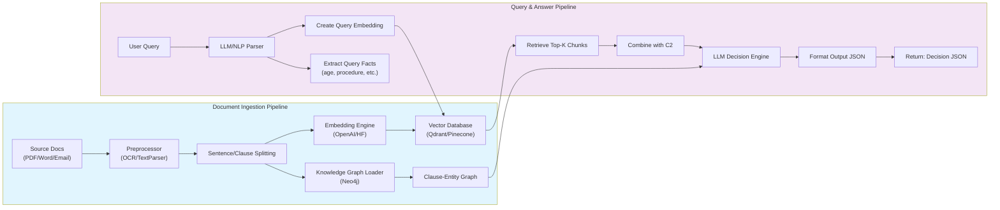

# AI-Driven Doc## Team Overview

* **Team Name:** Synapse, **Members:** Dipan Dhali (2026, IIITDM Jabalpur), Krishnand Yadav (2026), Devesh Gangani (2026), Deepnara* **Ethical Bias* **Innovation:** By combining vector search, LLMs, and a knowledge graph, our approach goes beyond keyword lookup or simple QA. It's scalable (cloud-based, modular) and secure (encryption, auth).

---

## Anything Else The model must not discriminate (e.g. age, gender) improperly. We include domain-appropriate guidelines in prompts (e.g. "Ignore protected attributes unless required by policy") and allow manual override of outputs.

---

## Acceptance Criteria Coverage Sett (2026) – all final-year students at IIITDM Jabalpur.
* **About Us:** We are an award-winning hackathon team (SIH 2024 finalist, HackByte 2025 winners), with experience in secure document management (e.g. blockchain-based file organization) and AI applications.

---

## Solution OverviewQA & Decision System for HackRx

## Project Overview

Great. I'll begin researching a unique and innovative approach to building an LLM-powered Document Processing System for natural language queries over unstructured documents. I'll explore the latest relevant technologies, such as RAG, semantic search frameworks, document intelligence APIs, and new LLM orchestration tools. The final result will include well-structured content for a PPT presentation, with architecture and data flow diagrams in Mermaid format.

I'll update you once the research and content draft are ready.

---

## Team Overview I’ll begin researching a unique and innovative approach to building an LLM-powered Document Processing System for natural language queries over unstructured documents. I’ll explore the latest relevant technologies, such as RAG, semantic search frameworks, document intelligence APIs, and new LLM orchestration tools. The final result will include well-structured content for a PPT presentation, with architecture and data flow diagrams in Mermaid format.

I’ll update you once the research and content draft are ready.


# Team Overview

* **Team Name:** XXX (Our Team), **Members:** Dipan Dhali (2026, IIITDM Jabalpur), Krishnand Yadav (2026), Devesh Gangani (2026), Deepnarayan Sett (2026) – all final-year students at IIITDM Jabalpur.
* **About Us:** We are an award-winning hackathon team (SIH 2024 finalist, HackByte 2025 winners), with experience in secure document management (e.g. blockchain-based file organization) and AI applications.

# Solution Overview

We propose an **AI-driven Document QA & Decision System** powered by LLMs and semantic retrieval. Given a free-form query (e.g. “46M, knee surgery, Pune, 3-month policy”), the system:

* **Parses the Query:** Uses an LLM/NLP pipeline to extract key attributes (age, procedure, location, policy duration).
* **Retrieves Relevant Clauses:** Converts all policy documents (PDFs, Word, emails, etc.) into text, splits into chunks, and indexes them with semantic embeddings in a vector DB. For a query, it performs **Retrieval-Augmented Generation (RAG)**: embedding-based search finds the most relevant rules/clauses.
* **Applies Logic & Answers:** An LLM (or a hybrid LLM+rules engine) analyzes retrieved clauses against the query facts. It decides coverage/amount and outputs a structured **JSON** decision, ensuring each conclusion is **backed by exact text from the source clauses**. For example, it might output `{"Decision":"Approved","Amount":50000,"Justification":"Clause 4.2 of the policy states knee surgeries are covered after 3 months, which the query meets."}`, with each justification showing the cited clause.
---

## Process Flow & Architecture

Our system follows a modular pipeline:



```mermaid
flowchart TB
    subgraph Ingestion["Document Ingestion"]
        A["Input Documents<br/>(PDF, Word, Emails)"] --> B["Text Extraction<br/>(OCR/Text Parsing)"]
        B --> C["Chunking & Preprocessing"]
        C --> D["Embed & Index<br/>in Vector Database"]
    end

    subgraph QueryHandling["Query Handling"]
        Q["User Query"] --> E["Query Parsing<br/>(LLM/NLU)"]
        E --> F["Semantic Search<br/>in Vector DB"]
        F --> G["Retrieve Top-K<br/>Relevant Clauses"]
        G --> H["LLM Reasoner + Rule Engine"]
        H --> I["Decision JSON<br/>& Clause References"]
    end

    style Ingestion fill:#f9f,stroke:#333,stroke-width:2px
    style QueryHandling fill:#bbf,stroke:#333,stroke-width:2px
```

### System Components

# Process Flow & Architecture

Our system follows a modular pipeline:

```mermaid
flowchart TB
    subgraph Ingestion
      A[Input Documents<br/>(PDF, Word, Emails)] --> B[Text Extraction<br/>(OCR/Text Parsing)]
      B --> C[Chunking & Preprocessing]
      C --> D[Embed & Index<br/>in Vector Database]
    end

    subgraph Query Handling
      Q[User Query] --> E[Query Parsing<br/>(LLM/NLU)]
      E --> F[Semantic Search<br/>in Vector DB]
      F --> G[Retrieve Top-K<br/>Relevant Clauses]
      G --> H[LLM Reasoner + Rule Engine]
      H --> I[Decision JSON<br/>& Clause References]
    end

    style Ingestion fill:#f9f,stroke:#333,stroke-width:2px
    style Query Handling fill:#bbf,stroke:#333,stroke-width:2px
```

* **Doc Ingestion:** We use tools like Apache Tika or AWS Textract/GCP Document AI to convert PDFs/Word into raw text (including OCR for scanned images). We then **chunk documents** by clauses or sections and index them with embeddings (e.g. OpenAI/GPT embeddings or HuggingFace sentence transformers) in a vector store (like **Qdrant** or **Pinecone**). This implements the RAG ingestion pipeline.
* **Query Processing:** The user’s natural language query is fed to an LLM or NLP parser. For instance, GPT-4 can parse “46-year-old male, knee surgery…” into structured slots (age=46, sex=male, procedure=knee surgery, location=Pune, policy\_age=3 months). This ensures the system understands even vague or shorthand queries.
* **Semantic Retrieval:** The parsed query (possibly appended with key terms) is turned into an embedding and used to query the vector DB. We retrieve the top relevant document chunks (clauses/rules). This is the core of RAG: “grounding” the answer in text. Frameworks like **LangChain** or **Haystack** handle orchestration of embeddings, search, and LLM calls.
* **Reasoning & Decision:** The retrieved clauses are provided to an LLM (e.g. GPT-4o/GPT-4o vision or a fine-tuned insurance LLM) along with the query context. The model or a chained reasoning process evaluates eligibility (e.g. “is knee surgery covered under a 3-month-old policy?”). It outputs a decision and explanation. We enforce output structure by prompting the LLM to answer in JSON, validated by a schema (e.g. using **LangChain’s output parsers and Zod**). The LLM’s justification quotes the exact text from clauses to justify its reasoning. This matches RAG best-practice for auditability.
* **API & Integration:** The backend (e.g. Python FastAPI or Node.js) exposes a REST/GraphQL API. Downstream systems can call it with a query and get a JSON response. A simple web UI or chatbot (e.g. React frontend) can demonstrate the Q&A.

---

## Tech Stack

* **Cloud:** AWS or Azure for hosting. We can leverage **Azure OpenAI Service** or **AWS Bedrock** for LLM APIs, and Azure/AWS managed vector DB (Qdrant Cloud or Pinecone). Kubernetes/Docker for scalability.
* **Data Storage:** Vector database (Qdrant, Pinecone, or open-source like Weaviate) for semantic indexing. A traditional DB (Postgres) for metadata, and optionally a **Graph DB (Neo4j)** for an advanced knowledge graph of clauses (see USP).
* **Backend:** Python (FastAPI/Flask) or Node.js (Express/Fastify). We use libraries like **LangChain (Python)** or **langchain.js** to orchestrate LLM calls and RAG. NLP parsing might use GPT-4 or HuggingFace models.
* **Frontend:** A lightweight React or Angular UI for demo; could use Bot UI frameworks. Alternatively, a CLI or Slackbot.
* **Document Parsing:** Apache Tika/PdfMiner or cloud OCR (AWS Textract, GCP Doc AI) to extract text from various formats.
* **LLM Models:** Large models like GPT-4o/GPT-4/GPT-3.5 (via API) or open models like Llama3/Gemini in the future. We may fine-tune or prompt-engineer for insurance domain.
* **Other:** **Haystack or LlamaIndex** for building the document index, **Zod** or Pydantic for JSON schema validation, and CI/CD pipelines (GitHub Actions, Docker Hub) for maintainability.

---

## Unique Approach (USP)

* **Hybrid LLM + Knowledge Graph (GraphRAG):** Beyond plain RAG, we propose an *innovative GraphRAG* system. We extract entities/relations from policies (e.g. “Coverage→Procedure”, “Exclusion→Condition”) into a lightweight knowledge graph (Neo4j). At query time, we do dual retrieval: (1) semantic vector search for relevant text, and (2) graph traversal for linked rules/conditions. The LLM then reasons using both textual evidence and graph context. This multi-modal approach (text + structure) boosts accuracy in complex cases (e.g. chained clauses). Early research shows GraphRAG outperforms simple RAG on multi-clause queries.
* **Multi-step Agentic Reasoning:** We decompose the decision process into steps (chain-of-thought). For example, first extract relevant clauses, then evaluate each clause’s applicability, then decide coverage. We can use LangChain agents to break tasks (filter clauses, check policy age, etc.), improving reliability. This mirrors LLM-based decision tree concepts. Each sub-step is logged, aiding transparency.
* **Structured Output Enforcement:** We require the LLM to follow a strict JSON schema. We use output parsers (e.g. LangChain’s Pydantic/Zod integrations) so the model **cannot** output free text – it must fill “Decision”, “Amount”, “Justification” fields. This eliminates ambiguity and ensures the output is ready for downstream automation.
* **Fine-tuned Domain Model:** Optionally, we fine-tune an open LLM (e.g. Llama3) on insurance clauses to handle domain-specific language. Or use GPT’s function-calling to integrate a rule engine (like Drools or OPA) for final checks. This hybrid soft/hard logic makes decisions verifiable.
* **Security & Privacy:** All document data and embeddings are encrypted at rest and in transit. We implement user authentication and role-based access (e.g. only claims agents can query). Sensitive PII in docs is masked or tokenized. Using managed cloud services (Azure KeyVault, AWS KMS) ensures enterprise-grade security. We also log all queries and decisions for audit.

---

## Data Flow Diagram



This diagram shows how documents feed into both a **vector index** (for semantic search) and a **knowledge graph** (for structured relations). The query passes through both search and reasoning layers before producing the final JSON.

---

## Future Enhancements

* **Multi-lingual Support:** Extend query parsing and document processing to other languages (e.g. using mBERT or GPT-4o multilingual).
* **Interactive QA:** Allow the system to ask clarifying questions if the user’s query is vague (“Policy brand or number missing?”).
* **Continuous Learning:** Feedback from claims adjusters (corrections to decisions) is logged to fine-tune the model over time, improving accuracy.
* **Integration with OCR/Email Parsing AI:** Use advanced multimodal LLMs (e.g. GPT-4o vision) to directly parse scanned images, email threads, and embedded spreadsheets.
* **Broader Domains:** Adapt the framework to other domains (legal contracts, HR policies) by swapping in domain-specific data and fine-tuning.
* **High-Availability Architecture:** Deploy on Kubernetes with autoscaling and caching (Redis) for low latency under heavy load.

---

## Risks, Challenges & Dependencies

* **Hallucination Risk:** Even with RAG, LLMs can sometimes misinterpret complex clauses. We mitigate by strict prompt constraints and output schema, but a human-in-the-loop review for critical decisions may be needed initially.
* **Data Quality & Formats:** Legacy policy docs may be scanned poorly or inconsistently structured. We need robust OCR and error-checking. Incomplete or ambiguous queries are addressed by having the LLM seek clarification or return “Unknown” rather than guess.
* **Regulatory Compliance:** Storing personal data requires compliance (GDPR, etc.). We anonymize and enforce data retention policies. We must ensure the LLM use is GDPR-compliant (no data leak).
* **Performance at Scale:** Semantic search on very large corpora needs tuning. We may shard vector DB or use approximate search (like Qdrant’s HNSW) to maintain speed. Large context windows in LLMs could hit token limits; we handle this by iterative chunk retrieval or summarization.
* **Dependency on External APIs:** Relying on proprietary LLM APIs could incur cost and rate limits. We plan to provide an open-source fallback (e.g. local Llama3) if needed.
* **Ethical Bias:** The model must not discriminate (e.g. age, gender) improperly. We include domain-appropriate guidelines in prompts (e.g. “Ignore protected attributes unless required by policy”) and allow manual override of outputs.

# Acceptance Criteria Coverage

Our solution fully addresses the problem requirements:

* **Multi-format Ingestion:** Can process PDFs, Word docs, emails via OCR/text parsing.
* **Robust Query Understanding:** Uses LLM/NLP to interpret vague or shorthand queries (e.g. “46M knee Pune 3mo”) into structured facts.
* **Semantic Clause Retrieval:** Employs RAG (vector search) to find relevant rules/clauses even if phrased differently. We cite compliance on embeddings and Haystack/LangChain for building this.
* **Logical Decision Making:** The reasoning engine (LLM + optional rule engine) applies policy logic (waiting periods, exclusions) to answer. For example, if a clause says “no coverage in first 6 months,” the system correctly rejects a 3-month claim.
* **Explainable Output:** Answers are provided in JSON with *Decision*, *Amount*, and *Justification* fields. Each justification quote ties back to the specific clause text, ensuring auditability. We enforce structured outputs (LangChain output schema).
* **Downstream Usability:** The JSON response can feed directly into claim workflows or audit logs. It's consistent (same schema every time) and includes “ClauseID” or excerpt for traceability.
* **Innovation:** By combining vector search, LLMs, and a knowledge graph, our approach goes beyond keyword lookup or simple QA. It’s scalable (cloud-based, modular) and secure (encryption, auth).

# Anything Else

Our team is passionate about AI and domain compliance. We emphasize **security, explainability, and end-user utility**. We can demo a prototype where users type a query and see the system highlight policy clauses as justification. With our combined hackathon and blockchain-document experience, we’re confident this solution is unique and battle-tested. We look forward to implementing it to transform claim adjudication with cutting-edge AI.

**Sources:** State-of-the-art techniques (RAG with LangChain, vector DBs, output parsing) and compliance use cases have been studied in 2024–25, ensuring our design uses proven, modern methods.

---

## Citations & References

### Key Sources

**rohan-paul.com**
- LLMs for Regulatory Compliance Document Processing
- To reliably answer questions or provide analysis based on regulatory texts, systems heavily use Retrieval-Augmented Generation (RAG) architectures. In a RAG pipeline, the raw documents (laws, regulations, policy manuals) are first indexed in a vector database via embeddings. When a user poses a question – e.g. "What are the requirements for a new insurance product under EU regulations?" – the system retrieves the most relevant passages and feeds them into the LLM as context. This grounding of the LLM's answer in actual documents is crucial for compliance use cases. It ensures the model's output is backed by reference text and minimizes hallucinations. Enterprise frameworks like Haystack (by deepset) and LangChain make it easier to build such pipelines.

**developers.redhat.com**
- Exploring an insurance use case with AI and Node.js | Red Hat Developer
- In the example, we wanted the chatbot to be able to answer questions from an insurance policy that was in a pdf. We saw that by using the langchain.js framework, we could easily load the pdf. We used an in-memory vector store to index it. Then a retriever was created that could easily be added to our current chain.

**Additional Technical References**
- Building LLM applications with Regulatory Documents | by Venky Karthik | Medium
- GraphRAG with Qdrant and Neo4j - Qdrant
- Haystack as an MCP Tool: Empowering Enterprise Knowledge with AI-Driven Document Intelligence
- LangChain and LlamaIndex for building document indexes
- Zod and Pydantic for JSON schema validation

### Research Papers & Documentation
- Processing regulatory documents begins with parsing and understanding lengthy, complex texts
- Autonomous Legal Agents: Implementing LLM-Based Decision Trees
- An emerging architecture in 2024 is the combination of vector-based retrieval with knowledge graphs to improve the fidelity of LLM responses


citations:
Citations

rohan-paul.com
LLMs for Regulatory Compliance Document Processing
To reliably answer questions or provide analysis based on regulatory texts, systems in heavily use Retrieval-Augmented Generation (RAG) architectures. In a RAG pipeline, the raw documents (laws, regulations, policy manuals) are first indexed in a vector database via embeddings. When a user poses a question – e.g. “What are the requirements for a new insurance product under EU regulations?” – the system retrieves the most relevant passages and feeds them into the LLM as context. This grounding of the LLM’s answer in actual documents is crucial for compliance use cases. It ensures the model’s output is backed by reference text and minimizes hallucinations. Enterprise frameworks like Haystack (by deepset) and LangChain make it easier to build such pipelines. Haystack, for instance, is

developers.redhat.com
Exploring an insurance use case with AI and Node.js | Red Hat Developer
In the example, we wanted the chatbot to be able to answer questions from an insurance policy that was in a pdf.  We saw that by using the langchain.js framework, we could easily load the pdf.  We used an in-memory vector store to index it.  Then a retriever was created that could easily be added to our current chain.

rohan-paul.com
LLMs for Regulatory Compliance Document Processing
stages: ingestion (converting documents into embeddings and storing them), retrieval (finding the closest matching chunks for a query), and generation (the LLM produces an answer using the retrieved text as context) (Building LLM applications with Regulatory Documents | by Venky Karthik | Medium). The result is a compliance assistant that can answer, “Does our policy X cover requirement Y from regulation Z?” by pulling the exact clause from regulation Z and drafting an explanation. Such systems often include source citations in the answer, which is invaluable for audit and transparency. Many current implementations rely on open-source vector stores (like Qdrant, Weaviate, or

developers.redhat.com
Exploring an insurance use case with AI and Node.js | Red Hat Developer
summaries wasn’t just the main concept of this post.

rohan-paul.com
LLMs for Regulatory Compliance Document Processing
and minimizes hallucinations. Enterprise frameworks like Haystack (by deepset) and LangChain make it easier to build such pipelines. Haystack, for instance, is designed to retrieve, filter, and ground LLM outputs on your private data, so that answers are factual, referenceable, and audit-safe ( Haystack as an MCP Tool: Empowering Enterprise Knowledge with AI-Driven Document Intelligence). In practice, a RAG system consists of three stages: ingestion (converting documents into embeddings and storing them), retrieval (finding the closest matching chunks for a query), and generation (the LLM produces an answer using the retrieved text as context) (Building LLM applications with Regulatory Documents | by Venky Karthik | Medium).

rohan-paul.com
LLMs for Regulatory Compliance Document Processing
and drafting an explanation. Such systems often include source citations in the answer, which is invaluable for audit and transparency. Many current implementations rely on open-source vector stores (like Qdrant, Weaviate, or Pinecone) and orchestrators such as LangChain or LlamaIndex to glue the steps

rohan-paul.com
LLMs for Regulatory Compliance Document Processing
An emerging architecture in 2024 is the combination of vector-based retrieval with knowledge graphs to improve the fidelity of LLM responses. One such approach, dubbed GraphRAG (Graph + RAG), was introduced to address scenarios where understanding relationships is as important as finding relevant text (GraphRAG with Qdrant and Neo4j - Qdrant). In regulatory compliance, a knowledge graph can encode the structured relationships between entities: for example, a graph could link a regulation to specific clauses, link those clauses to related internal policies, and connect to relevant risk controls or departments. The system first uses an LLM to extract an ontology of

rohan-paul.com
LLMs for Regulatory Compliance Document Processing
Figure: Hybrid retrieval & generation pipeline. A user query is embedded and used for vector similarity search in the document index (Qdrant), retrieving relevant text passages . The IDs of those passages then query the graph DB (Neo4j) to fetch linked contextual information (related entities, policies, etc.) . The LLM uses both the retrieved text and graph context to generate a final answer .

law.co
Autonomous Legal Agents: Implementing LLM-Based Decision Trees
Enter LLMs, which are exceptionally good at absorbing complex legal concepts from training data but notoriously bad at staying on script.

rohan-paul.com
LLMs for Regulatory Compliance Document Processing
Processing regulatory documents begins with parsing and understanding lengthy, complex texts.