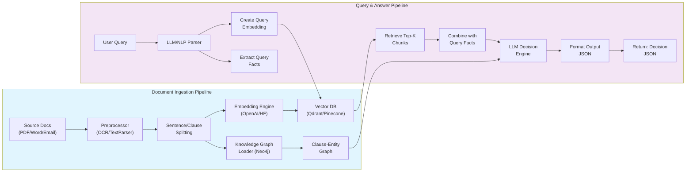

# Slide 1: Team Name & Members

**Team Name:** Synapse

**Members:**
- Dipan Dhali (2026, IIITDM Jabalpur)
- Krishnand Yadav (2026, IIITDM Jabalpur)
- Devesh Gangani (2026, IIITDM Jabalpur)
- Deepnarayan Sett (2026, IIITDM Jabalpur)

---

# Slide 2: About Us

- SIH Finalist 2024 (Standardizing Odd School Structures)
- HackByte 2025 National Hackathon winners (Sault: secure blockchain document management)
- Experience in multi-agent systems, knowledge graphs, and AI document intelligence

---

# Slide 3: Problem Statement & Solution Overview

**Problem:**
Current LLM document QA systems (RAG) are brittle, shallow, and lack reasoning. They fail on multi-hop queries, context fragmentation, and dynamic updates.

**Solution:**
Synapse: A cognitive agent framework for dynamic document intelligence. Multi-agent, graph-based, self-correcting, and radically transparent. Answers complex queries over unstructured docs with deep reasoning, real-time updates, and explainable outputs.

---

# Slide 4: Process Flow

```mermaid
flowchart TB
    subgraph Ingestion["Document Ingestion"]
        A["Input Documents<br/>(PDF, Word, Email)"] --> B["Text Extraction<br/>(OCR/Text Parsing)"]
        B --> C["Chunking & Preprocessing"]
        C --> D["Embed & Index<br/>in Vector DB"]
    end

    subgraph QueryHandling["Query Handling"]
        Q["User Query"] --> E["Query Parsing<br/>(LLM/NLU)"]
        E --> F["Semantic Search<br/>in Vector DB"]
        F --> G["Retrieve Top-K<br/>Relevant Clauses"]
        G --> H["LLM Reasoner +<br/>Rule Engine"]
        H --> I["Decision JSON &<br/>Clause References"]
    end

    style Ingestion fill:#f9f,stroke:#333,stroke-width:2px
    style QueryHandling fill:#bbf,stroke:#333,stroke-width:2px
```

---

# Slide 5: Tech Stack

- **Cloud:** Azure/AWS (OpenAI Service, Bedrock)
- **Vector DB:** Qdrant, Pinecone, Neo4j (GraphRAG)
- **Backend:** Python (FastAPI), LangChain, Haystack
- **Frontend:** React/Streamlit
- **Document Parsing:** unstructured.io, Apache Tika, Textract
- **LLM Models:** GPT-4o, Claude 3 Opus, Llama3
- **Security:** Encryption, RBAC, audit logs

---

# Slide 6: Solution Architecture

---

# Slide 7: Unique Selling Points (USP)

- **Hybrid GraphRAG:** Combines semantic search and knowledge graph traversal for deep, multi-hop reasoning
- **Multi-agent workflow:** Self-correcting system using LangGraph
- **Radical transparency:** Interactive reasoning path visualization
- **Structured outputs:** Auditable JSON responses with source citations
- **Real-time updates:** Incremental graph evolution capabilities

---

# Slide 8: Future Enhancements

- **Multi-lingual support:** Global language processing capabilities
- **Interactive QA:** System asks clarifying questions when needed
- **Continuous learning:** User feedback integration for model improvement
- **Advanced multimodal parsing:** Enhanced image and email processing
- **High-availability deployment:** Scalable cloud infrastructure with auto-scaling

---

# Slide 9: Risks, Challenges & Dependencies

- **LLM hallucination risk:** Mitigated by output grading and human-in-the-loop validation
- **Data quality challenges:** Robust OCR and error handling mechanisms
- **Regulatory compliance:** GDPR compliance with PII masking and data protection
- **Performance at scale:** Vector DB sharding and intelligent caching strategies
- **API dependencies:** Open-source fallback options to reduce vendor lock-in
- **Ethical bias prevention:** Prompt guidelines and manual override capabilities

---

# Slide 10: Acceptance Criteria Coverage

- **Multi-format ingestion:** PDF, Word, email processing capabilities
- **Robust query understanding:** Advanced LLM/NLP parsing for natural language
- **Semantic clause retrieval:** RAG and GraphRAG for intelligent document search
- **Logical decision making:** LLM + rule engine for accurate policy evaluation
- **Explainable outputs:** Structured JSON with clause references and justifications
- **Downstream usability:** REST API integration with audit logging
- **Innovation factor:** Multi-modal, agentic, and enterprise-secure architecture

---

# Slide 11: Anything Else

- **Team passion:** Deep expertise in AI, security, and regulatory compliance
- **Live demonstration:** Interactive query system with clause highlighting
- **Proven track record:** Battle-tested approach from previous hackathon successes
- **Market readiness:** Prepared to transform insurance claim adjudication with cutting-edge AI
- **Scalable vision:** Framework adaptable to legal, HR, and other compliance domains

---

# Slide 12: References & Citations

**Key Sources & Technologies:**
- Technical references available in `data.md` documentation
- Research papers: Reddit discussions, MDPI publications, Neo4j GraphRAG documentation
- Frameworks: LangChain, Haystack, OpenAI APIs, unstructured.io
- Domains: Regulatory compliance, GraphRAG architectures, agentic workflows, explainable AI systems

**Contact Information:**
- GitHub: [github.com/team-synapse/synapse-rag](https://github.com/team-synapse/synapse-rag)
- Email: team.synapse.hackathon@email.com
